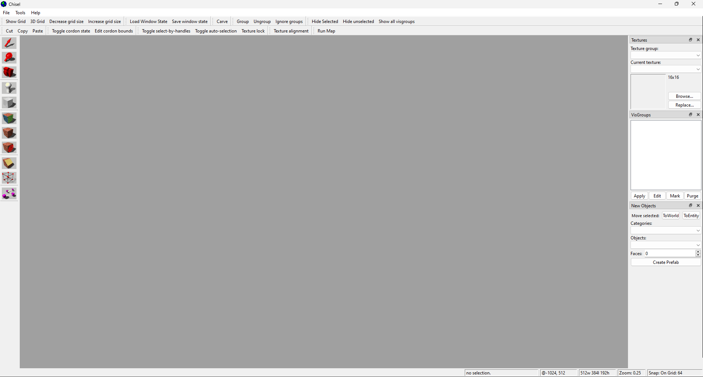
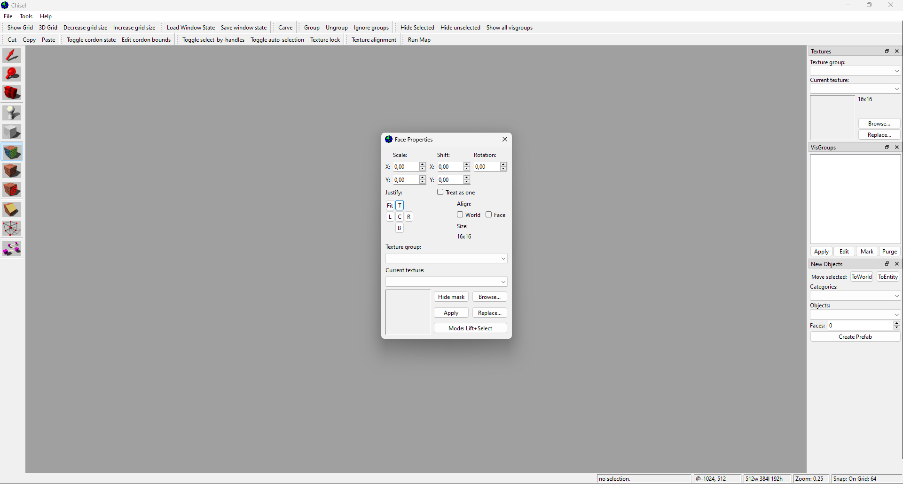
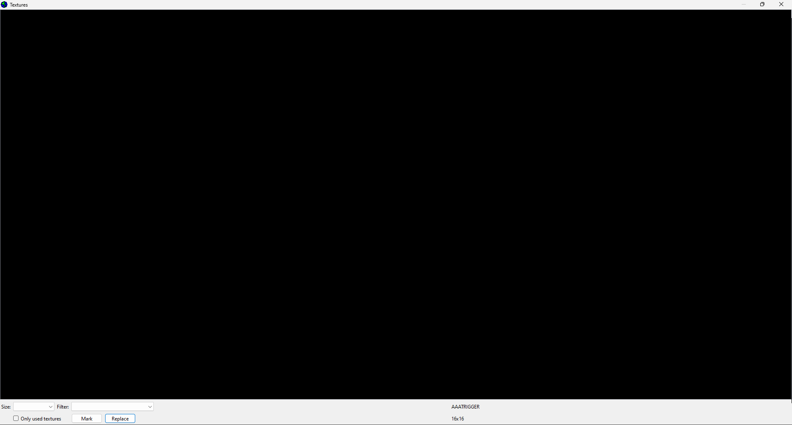
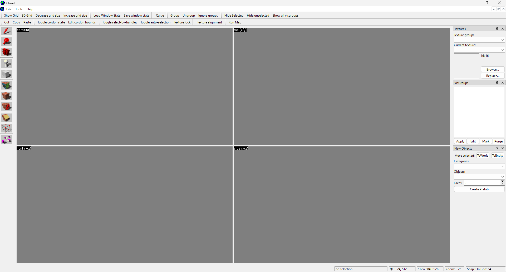
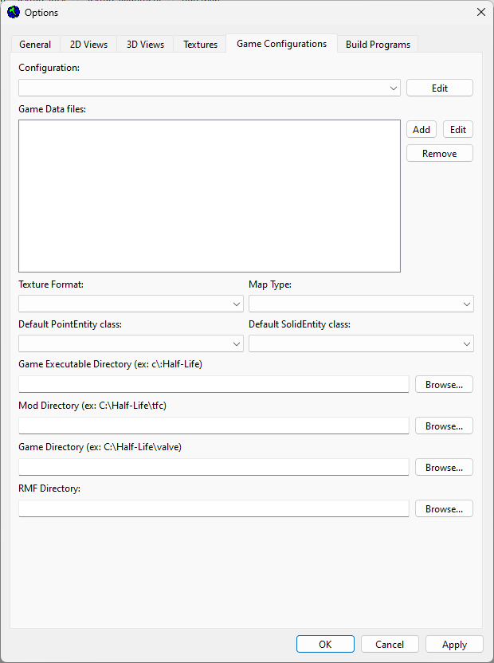

# Proof-of-concept Qt-based UI for Hammer 3.4

This is a proof-of-concept, codenamed `Chisel`, for a Qt-based graphical user interface for Valve Hammer Editor 3.4, a level editor for the game Half-Life 1 and its expansions and other games and mods running on the Half-Life 1 (GoldSource) engine.

This is purely a mockup with no actual application logic and does not function. Some icons were copied from Hammer using screenshots or extracted from the executable.

With Hammer's code in hand building a new user interface should be pretty straightforward, modernizing the interface, resizing it for larger resolutions, providing a native Linux version, fixing bugs and implementing non-functional user interface elements present in Hammer 3.5 beta.

It is recommended to also update the OpenGL code to use OpenGL 3.1 or newer (vertex, index and uniform buffers, shaders using `flat` qualifier, core context) to help deal with performance issues and driver compatibility issues involving deprecated functionality.

## Building

Use CMake 3.27 or newer to generate the project files. Visual Studio 2022 was used to develop this, targeting the Win64 architecture on Windows.

Use Qt's maintenance tool to obtain the Qt6 dependencies. It can be downloaded from the Qt website and is used to install Qt 6 (version 6.6 recommended since that was used to develop this).

Specify the paths to the Qt6 dependencies located in `<Qt6 install directory>/msvc2019_64/lib/cmake`.

Each `Qt6<componentname>_DIR` variable has an equivalent `Qt6<componentname>` directory that must be specified. CMake can find some automatically after specifying `Qt6_DIR` but there are others that must be specified manually.

## Screenshots

UI elements don't match the original sizes exactly, but this is easy enough to adjust.

The toolbar below the menu bar is separated into multiple smaller bars to allow groups of buttons to be moved. Hammer has 2 sets of toolbars which limits the customization options.

It is recommended to add a "reset UI to default" button to reposition everything to its initial location.

The locale probably needs adjusting to the C locale to ensure consistent number formatting.

The texture list is an OpenGL widget, this may or may not be the case in an actual UI depending on how feasible it is to render.

All 4 views are OpenGL windows rendering the text in the top-left corner using a `QPainter`.

The `camera` text is highlighted because the mouse is hovering over it, matching Hammer's behavior.

The splitters behave slightly differently due to a lack of a center handle to move both at the same time.

The Options dialog is almost identical, differing mainly due to different sizes and alignments.
